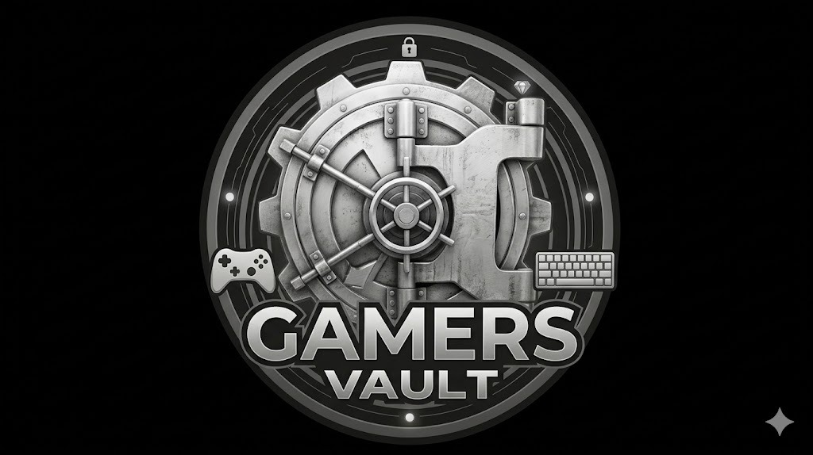
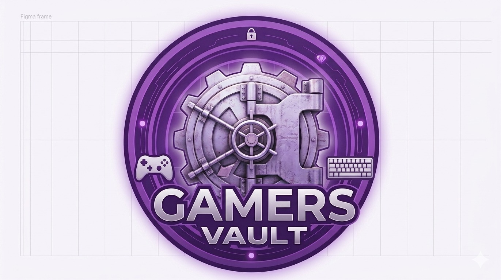

# Product Design & Decisões de Negócio

Esta seção documenta o raciocínio por trás da identidade e do modelo de negócios do projeto.

---

## 🎮 A Escolha do Tema: Por que uma Loja de Jogos?

A decisão de desenvolver uma plataforma de distribuição de jogos e comunidade nasceu de três fatores centrais:
1. **Familiaridade da Equipe:** Todos os membros compartilham interesse e vivência real com plataformas como Steam, Epic Games e PSN, facilitando o entendimento dos requisitos de um ecossistema real. Além disto, era um tema que todos tinham vontade de explorar, o que aumentou o engajamento e a criatividade durante o desenvolvimento.

2. **Complexidade Relacional Ideal:** Um sistema de e-commerce de jogos propicia um escopo que exige interações complexas com o SGBD. Ele naturalmente demanda relacionamento *"Muitos para Muitos (N:M)"* (Pedem-se muitos jogos em muitos pedidos), validando os fundamentos de Ciência da Computação sem perder o apelo do software interativo.

3. **Escalabilidade (Roadmap):** Ao contrário de projetos engessados, a indústria de jogos nos permitiu planejar módulos mais complexos de interação e features futuras para a comunidade (análises, fóruns e biblioteca virtual em nuvem).

---

## 🎨 Identidade Visual e O Logotipo

**V.1 - Primeira Prototipação:**

**V.Final - Atual:**

* **Conceito do "Cofre" (Vault):** Remete diretamente à percepção de **segurança digital**. A ideia é que o repositório de jogos e dados do usuário seja seu bem mais valioso e esteja fortemente protegido (fato que baseou nossa escolha por algoritmos de hashing nas linhas de backend).
* **Cromática Empregada:** A identidade migrou de abordagens sombrias e industriais em sua "V.1" para uma consolidação visual utilizando tons **Neon e Roxo/Magenta**. Essas cores representam a assinatura clássica da cultura de e-sports, setups de LED RGB e o cenário tecnológico moderno, criando conexão instantânea com o nosso público-alvo (Gamers de 16 a 35 anos).
* **Inspiração (A Franquia Fallout):** O conceito central, o termo *Vault* e a engrenagem estilizada, são homenagens diretas aos lendários refúgios da série de jogos *Fallout* (da Bethesda). A iconografia resgata rapidamente a memória afetiva de jogadores veteranos e fãs da franquia.

---

## 🧠 UX e Decisões de Protótipo (CLI)

Geralmente, aplicações que rodam apenas em terminais lidam mal com iterações de usuários fora da bolha da programação. 

Como nosso escopo obrigava a execução via prompt, aplicamos fortes princípios de Design de Experiência do Usuário (UX) para criar um ambiente menos inóspito no terminal:

* **Desacoplamento Visual:** Recusamos o formato de "Tudo no mesmo painel". O sistema isola os usuários pela permissão da Sessão: `menu_cliente.py` concentra um ambiente voltado unicamente para consumo, busca e exploração; e o `menu_admin.py` entrega permissões restritivas de CRUD e relatórios brutos do SGBD de forma escondida.

* **DataGrid Simulado em Terminal:** A impressão (o "print") das requisições via SGBD não expõe matrizes complexas; o sistema foi formatado via lógica Python para limitar quebras de linhas, exibindo quadros delimitados e separados de forma similar a tabelas HTML, evitando poluição visual.

* **Graceful Degradation (Tolerância a falhas de entrada):** Quando falhas acontecem no input do teclado por parte do usuário (como digitar letras onde deveriam ser números de ID, ou solicitar itens não registrados), ele não sofre crashes nem toma Stacktraces agressivos na cara. Tudo é validado previamente e o sistema reabre os menus com dicas claras de condução ("*Opção inválida, verifique o ID e tente novamente*").