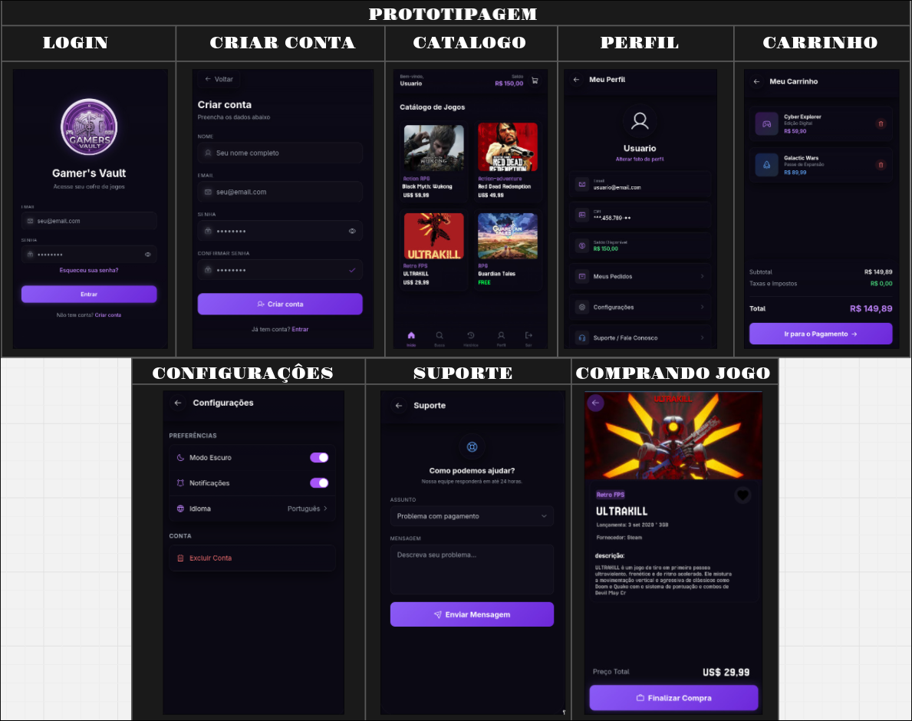

# 💻 Protótipo e Interface Web

> **Importante:** Este site atua unicamente como um **protótipo de interface (mockup estático)**. Ele não possui conexão (Backend/API) com o banco de dados principal do sistema . Consequentemente, nenhuma conta é efetivamente criada e nenhuma compra interage com regras de negócios reais. O site serve unicamente para o usuário clicar, explorar as animações e visualizar para onde cada botão direciona na jornada do produto.

## A Escolha do Design
O desenvolvimento da UI do protótipo da **Gamers Vault** foi pautado pela premissa de uma experiência agradável. 

Escolhemos a identidade escura para ser confortável aos olhos mesclada à estética *minimalista* O intuito central dessa abordagem foi **combinar harmoniosamente com a nova logo do projeto**, além de manter todas as telas extremamente minimalistas e fáceis de navegar pelos clientes, ressaltando o que mais importa: **o catálogo de jogos**.

## Estruturação Visual e Fluxo
Antes da codificação estática da página web, toda a arquitetura da informação, componentes e fluxos de tela foram idealizados combinando rascunhos em ferramentas brancas como o **Miro** e consolidando em guias de padronização no **Figma**.

Abaixo, você confere a ilustração do mapa da interface, que foi feito como a base para o prótotipo interativo em HTML/CSS. A versão abaixo é uma representação inicial feita no miro.

*(Esquema das estruturas das telas na web)*

---

⚠️ **Disclaimer e Nota de Autoria Científica:**

> As imagens de jogos utilizadas no protótipo são de propriedade 
de seus respectivos desenvolvedores e foram usadas apenas para 
fins ilustrativos em contexto acadêmico.

 

