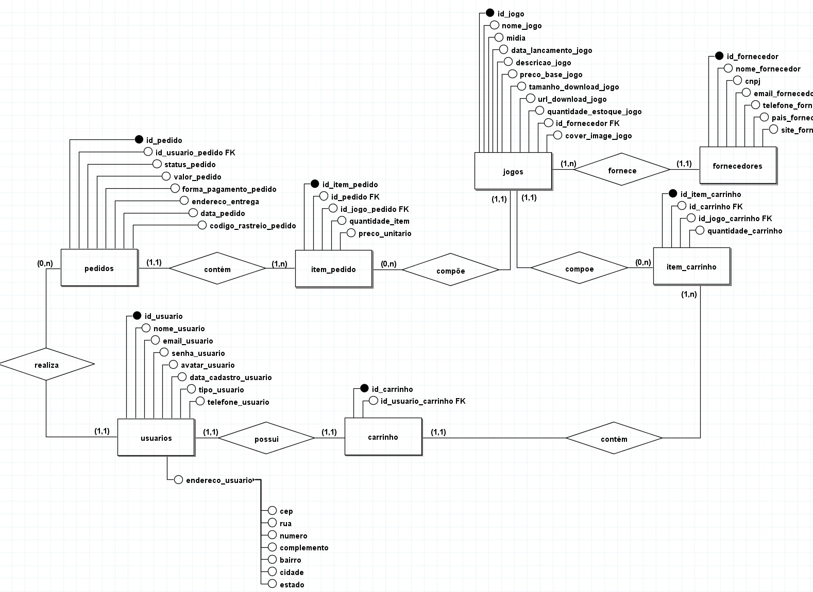

# Modelagem do Banco de Dados

O SGBD escolhido para a persistência dos dados do *Gamers Vault* foi o **MySQL / MariaDB**. Nosso objetivo foi criar uma estrutura relacional (SQL) que garantisse forte integridade referencial, previnisse dados duplicados e registrasse um histórico financeiro imutável.

---

## 🗺️ Modelo Entidade-Relacionamento (MER)

*(Abaixo: O diagrama conceitual projetado na fase de ideação usando o software BrModelo)*

> [!NOTE] 
> **Decisão Técnica de MVP:** Como visto no diagrama inicial, previmos tabelas de `carrinho_de_compras` e `endereco_usuario`. Durante o desenvolvimento, alteramos a arquitetura: **movemos o carrinho para a RAM (Sessão do terminal em Python)** para poupar chamadas (queries) desnecessárias no banco de dados, melhorando a performance. Além disto, abstraímos os endereços físicos para focar na entrega 100% digital do MVP.

---

## 🐬 Dicionário de Dados e Estrutura das Tabelas

O banco atual (`gamers_vault.sql`) opera com 5 tabelas centrais. Abaixo explicamos a responsabilidade e o "porquê" das tipagens escolhidas para cada uma:

### 1. `usuarios`
Responsável pela autenticação e carteira digital.
* **Tipagem Estratégica (`senha_usuario`):** Usamos o tipo `CHAR(60)` e não `VARCHAR`, pois já sabíamos que a biblioteca **Bcrypt** no Python gera um hash de exatos 60 caracteres. Usar `CHAR` garante máxima performance de leitura.

* **Tipagem Financeira (`saldo`):** Definido como `DECIMAL(10,2)`. Diferente do tipo `FLOAT`, o `DECIMAL` não sofre com falhas de arredondamento na linguagem de máquina, garantindo que nenhum centavo desapareça.

* **Tipagem de Hierarquia (`tipo_usuario`):** O campo `tipo_usuario` é um `ENUM` que aceita apenas os valores `'admin'` ou `'cliente'`. Isso reforça a segurança, pois o banco de dados rejeitará qualquer tentativa de inserir um valor inválido, como 'usuario' ou 'guest'.

### 2. `fornecedores`
Armazena as publicadoras parceiras.
* **Prevenção de Duplicidade:** Os campos `email_fornecedor` e `cnpj_fornecedor` possuem a constraint `UNIQUE`. É impossível cadastrar duas vezes a mesma empresa, bloqueando falhas humanas na administração.

### 3. `jogos`
O catálogo central, interligado (N:1) com `fornecedores` através de Chave Estrangeira (`id_fornecedor_fk`).

### 4. `pedidos` (Cabeçalho da Transação)
Registra o evento de compra do usuário. Define status como `pago`, `cancelado` ou `pendente` através da trava `ENUM`. O uso do `ENUM` blindou nossa aplicação: se o Python tentar inserir um status "concluido", o MySQL rejeita ativamente.

### 5. `item_pedido` (Tabela Pivô N:M)
A tabela mais inteligente do sistema, que resolve a relação de *Muitos Pedidos* para *Muitos Jogos*.
* **Histórico Congelado (`preco_unitario`):** Quando um jogo é comprado, seu preço atual é copiado para cá. Isso significa que, se no mês seguinte o Administrador dobrar o preço de um jogo na tabela `jogos`, o histórico de compra do cliente em `item_pedido` não sofrerá alteração.

---

## 🛡️ Medidas de Segurança e Integridade (Constraints)

Fora as validações feitas em Python, implementamos amarras diretamente na criação do banco (`gamers_vault.sql`):

* **`ON DELETE RESTRICT` (Proteção de Dependentes):** 
Em tabelas-pai (como `fornecedores` e `jogos`), configuramos chaves restritivas. O banco de dados **proíbe que um Administrador apague do sistema um fornecedor que ainda possua jogos cadastrados**. Da mesma forma, um jogo não pode ser deletado se ele já estiver atrelado ao número de recibo de algum cliente (`item_pedido`). 

* **`ON DELETE CASCADE` (Limpeza Mestre):**
A tabela de itens(`item_pedido`) segue o pedido-mestre (`pedidos`) em modo cascata. Ou seja, se (hipoteticamente) um pedido for totalmente cancelado e apagado da base, todos os pequenos itens anexados a ele se auto-destroem juntos, evitando dados fantasmas ocupando espaço no servidor. (Lembrando que temos as devidas validações para que isso não aconteça acidentalmente)

---

## 📜 Script DDL (Visão Completa)

Para visualizar todo o dimensionamento de queries, `CREATE TABLES` com as contraints de FK (Foreign Keys) aplicadas e os tamanhos das instâncias em sua totalidade, veja o script principal fornecido:

👉 **[Acessar a Query Completa do SGBD](../Banco%20de%20dados/MySql/gamers_vault.sql)**